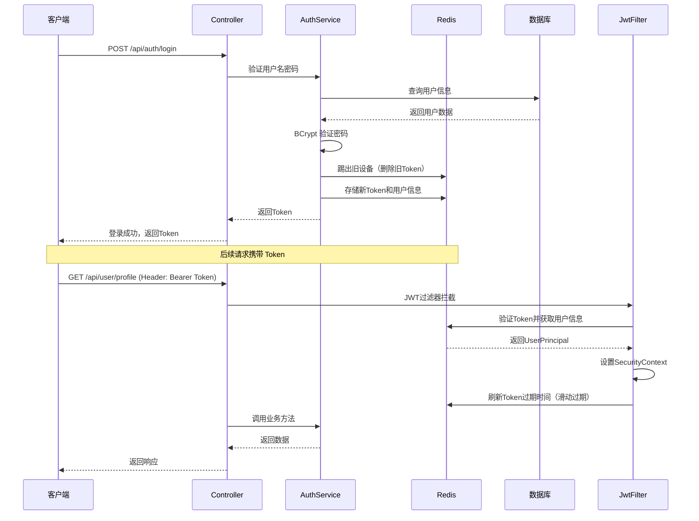

# 🌕Charon

<div align="center">


**Spring Boot 应用开发模板**

[](https://spring.io/projects/spring-boot)  [](LICENSE)  [](https://www.oracle.com/java/)

一个功能完整、安全可靠、开箱即用的 Spring Boot 项目模板，专为提升企业级应用开发效率而设计。

[快速开始](#-快速开始) • [功能特性](#-功能特性) • [配置说明](#️-配置说明) • [API文档](#-api-文档)

</div>

---

## 📖 项目概述

Charon 是一个基于 Spring Boot 3 的企业级应用开发模板，整合了现代 Java 开发的最佳实践，旨在帮助开发人员：

- ⚡ **快速启动项目**：在数分钟内快速完成项目初始化
- 🎯 **专注业务开发**：通用功能开箱即用，减少 50% 以上的重复开发工作
- 🔒 **保障系统安全**：集成 Spring Security 和多重加密策略
- 📊 **提升开发效率**：统一的代码规范和完善的工具链支持
- 🏗️ **易于维护扩展**：清晰的分层架构和标准化的项目结构

### 🎯 核心特性

| 特性分类 | 功能描述 |
|---------|---------|
| 🔐 **认证授权** | Spring Security 6.x + Redis 无状态认证、JWT Token 管理、单点登录/互踢机制、滑动过期策略 |
| 🗄️ **数据访问** | MyBatis-Plus 增强、逻辑删除和自动填充、分页查询、P6Spy SQL 监控 |
| 🔒 **安全加密** | BCrypt 密码加密、ECC 非对称加密、手动加密控制、安全配置管理 |
| 📝 **API 文档** | Knife4j 集成、OpenAPI 3 规范、在线调试功能、接口分组管理 |
| 📊 **日志追踪** | MDC 链路追踪（traceId）、统一日志格式、SQL 执行日志、请求耗时统计 |
| 🚨 **异常处理** | 全局异常捕获、统一错误码体系、业务异常分类、预期/非预期异常处理 |
| ⚙️ **多环境** | 多环境配置、环境变量管理、敏感信息保护、配置文件继承 |
| 🛠️ **开发工具** | Lombok 简化代码、HikariCP 连接池、统一返回格式、参数自动校验 |

---

## 🏗️ 技术架构

### 核心技术组件

| 组件 | 版本 | 说明 |
|------|------|------|
| **Spring Boot** | 3.5.6 | 核心框架，使用 Jakarta EE 9+ |
| **Spring Security** | 6.x | 安全认证授权框架 |
| **MyBatis-Plus** | 3.5.12 | 增强型 MyBatis，简化 CRUD 操作 |
| **Redis** | Spring Data Redis | Token 存储和会话管理 |
| **HikariCP** | 5.x | 高性能数据库连接池 |
| **Knife4j** | 4.4.0 | API 文档生成和在线调试 |
| **P6Spy** | 1.9.1 | SQL 执行日志监控 |
| **BouncyCastle** | 1.78.1 | ECC 加密算法支持 |
| **Lombok** | 1.18.34 | 简化 Java 代码 |
| **Logback** | - | 日志管理和链路追踪 |

### 分层架构

```
src/main/java/com/dawnmoon/springboot_app_template/
├── 📁 controller/              # 控制器层 - REST API 接口
│   ├── AuthController.java    # 认证授权接口
│   └── UserController.java    # 用户管理接口
│
├── 📁 service/                 # 服务层 - 业务逻辑处理
│   ├── AuthService.java
│   ├── UserService.java
│   └── serviceImpl/           # 服务实现
│
├── 📁 mapper/                  # 数据访问层 - MyBatis Mapper
│   ├── UserMapper.java
│   ├── RoleMapper.java
│   └── UserRoleMapper.java
│
├── 📁 model/                   # 模型层
│   ├── entity/                # 数据库实体类
│   │   ├── BaseEntity.java   # 基础实体（自动填充、逻辑删除）
│   │   ├── User.java
│   │   ├── Role.java
│   │   └── UserRole.java
│   ├── request/               # 请求参数对象
│   └── response/              # 响应对象
│
├── 📁 common/                  # 通用组件
│   ├── api/                   # 统一返回格式
│   │   └── ApiResponse.java
│   ├── enums/                 # 枚举类
│   │   ├── BaseEnum.java
│   │   └── ErrorCode.java    # 统一错误码
│   ├── exception/             # 异常处理
│   │   ├── BusinessException.java
│   │   └── GlobalExceptionHandler.java
│   ├── log/                   # 日志组件
│   │   └── TraceIdFilter.java # MDC 链路追踪
│   └── security/              # 安全组件
│       ├── JwtAuthenticationFilter.java
│       ├── UserPrincipal.java
│       └── SecurityUtil.java
│
├── 📁 config/                  # 配置类
│   ├── MybatisPlusConfig.java
│   ├── RedisConfig.java
│   ├── SecurityConfig.java
│   └── Knife4jConfig.java
│
└── 📁 util/                    # 工具类
    ├── CryptoUtil.java        # 加密工具（BCrypt + ECC）
    └── PageUtil.java          # 分页工具
```

### 认证流程



---

## 🚀 快速开始

### 环境要求

| 软件 | 版本要求 |
|------|---------|
| **JDK** | 17+ |
| **Maven** | 3.9+ |
| **MySQL** | 8.0+ |
| **Redis** | 6.0+ |

### 快速安装

#### 1️⃣ 克隆项目

```bash
git clone https://github.com/DawnMoon1542/Charon.git
cd charon
```

#### 2️⃣ 初始化数据库

本项目目前支持MySQL和PostgreSQL，可以使用 [该目录](https://github.com/DawnMoon1542/Charon/tree/master/src/main/resources/sql) 下的sql文件初始化数据库。

#### 3️⃣ 配置敏感信息

使用 `src\main\resources\secret.yaml.example` 文件创建 `src\main\resources\secret.yaml` 文件，并在其中配置各个密钥。

#### 4️⃣ 编译运行

推荐使用IntelliJ IDEA编译运行。

#### 6️⃣ 验证运行

访问以下地址验证成功运行：

- **API 文档**: http://localhost:8081/doc.html
- **Swagger UI**: http://localhost:8081/swagger-ui.html
- **健康检查**: http://localhost:8081/actuator/health (如果启用)

**测试登录接口：**

```bash
curl -X POST http://localhost:8081/api/auth/login \
  -H "Content-Type: application/json" \
  -d '{
    "username": "admin",
    "password": "admin123"
  }'
```

**响应示例：**

```json
{
  "code": "SUCCESS",
  "message": "操作成功",
  "data": "your-jwt-token-here",
  "timestamp": 1719876543210
}
```

---

## 🙏 致谢

感谢以下开源项目：

- [Spring Boot](https://spring.io/projects/spring-boot)
- [MyBatis-Plus](https://baomidou.com/)
- [Spring Security](https://spring.io/projects/spring-security)
- [Knife4j](https://doc.xiaominfo.com/)
- [Redis](https://redis.io/)
- [Lombok](https://projectlombok.org/)
- [BouncyCastle](https://www.bouncycastle.org/)

---

<div align="center">

**如果这个项目对你有帮助，请给一个 ⭐ Star 支持一下！**

By DawnMoon

</div>

